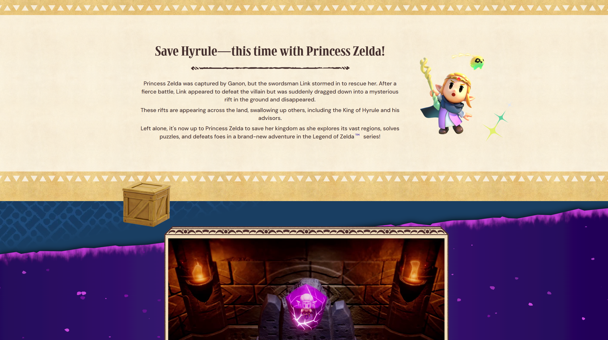
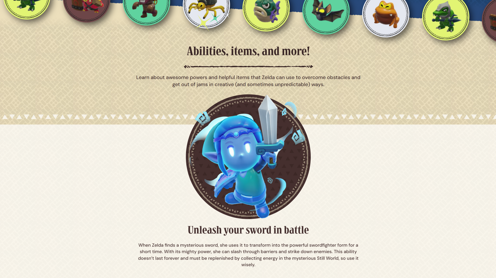
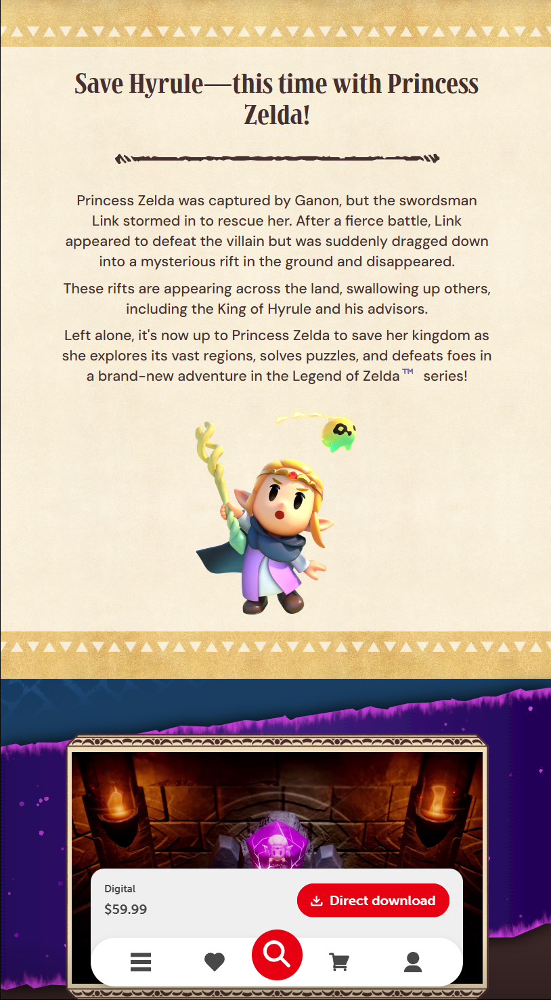
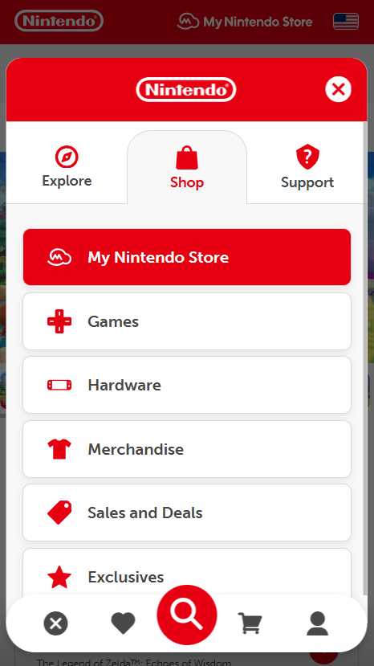
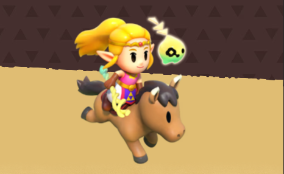
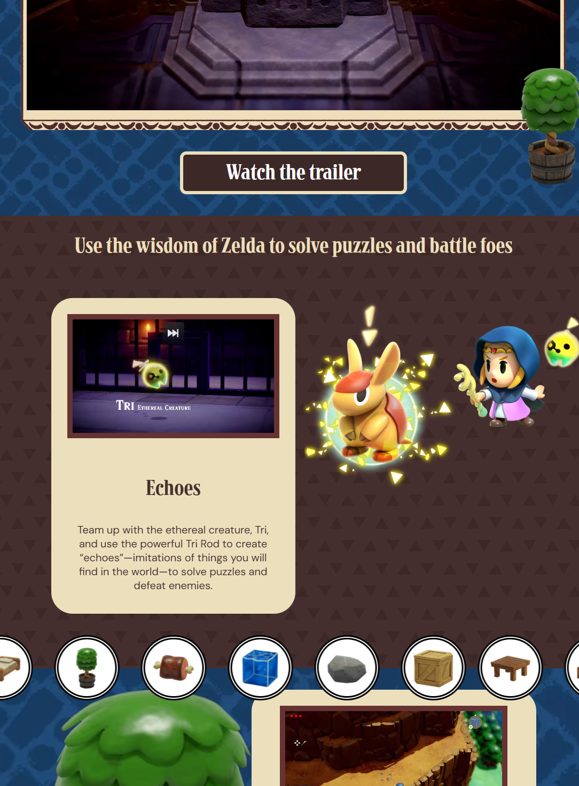
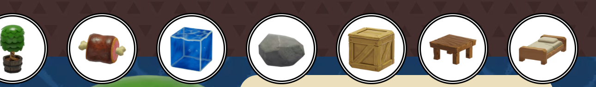
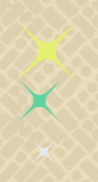

# Procesverslag

## Ik

  ### Auteur:
  Naoufal Bchiri

  #### Je startniveau:
  Zwart

  #### Je focus:
  Surface
 

## Je website

  ### Je opdracht:
  [Legend of Zelda: Echoes of Wisdom](https://www.nintendo.com/us/store/products/the-legend-of-zelda-echoes-of-wisdom-switch)

  #### Screenshot(s) van de eerste pagina (small screen):
  

  #### Screenshot(s) van de tweede pagina (small screen):
  
  
  #### Screenshot van de pagina (small screen): 
  Nummer Selectie Pagina  
  
 

## Toegankelijkheidstest 1/2 (week 1)

  
uitwerken na test in 2e werkgroep

  ### Bevindingen
  Lijst met je bevindingen die in de test naar voren kwamen:

  Veel errors vanwege onconfentionele tags, waarschijnlijk door compatibiliteit met server-side datacollectie en het tegengaan van piraten

## Breakdownschets (week 1)

  
uitwerken na afloop 3e werkgroep

  ### de hele pagina: 
  

  ### dynamisch deel (bijv menu):
  Mobile only menu
  
  

  ### wellicht nog een dynamisch deel (bijv filter):
  Bewegend met scroll
  
  

## Toegankelijkheidstest 2/2 (week 4)

  
uitwerken na test in 9e werkgroep

  ### Bevindingen
  Lijst met je bevindingen die in de test naar voren kwamen (geef ook aan wat er verbeterd is):
  De HTML bestand is nogsteeds niet geldig, maar dit keer voor een meer duidelijke reden.
  De site bestaat vooral uit decoratie images dus voor veel gebruikte ik een null alt.
  Er is geen audio bij de videos dus ik liet ze automatisch afspelen en herhalen.
  Buttons en links hebben zelden een stilistisch verschil.

## Eindgesprek (week 5)

  
uitwerken voor eindgesprek

  ### Je uitkomst - karakteristiek screenshots:
  

  ### Dit ging goed/Heb ik geleerd: 
  Animated Carrousel

  

  ### Dit was lastig/Is niet gelukt:
  Cursor Decoratie :(

  

## Voorgangs gesprekken!

Eruit gehaald vanwegen een mix van vergeten en weinig boeien ¯\\(ツ)/¯

## Bronnenlijst

  
Lijst

  1. Alle assets (videos & plaatjes) genomen van de officiele site van (Legend of Zelda: Echoes of Wisdom van) Nintendo

