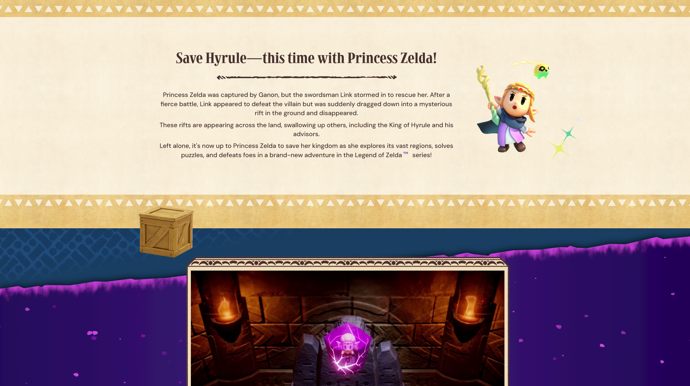

# Procesverslag

## Ik

  ### Auteur:
  Naoufal Bchiri

  #### Je startniveau:
  Zwart

  #### Je focus:
  Surface
 

## Je website

  ### Je opdracht:
  [Legend of Zelda: Echoes of Wisdom](https://www.nintendo.com/us/store/products/the-legend-of-zelda-echoes-of-wisdom-switch)

  #### Screenshot(s) van de eerste pagina (small screen):
  

  #### Screenshot(s) van de tweede pagina (small screen):
  

  #### Screenshot van de pagina (small screen): 
  Nummer Selectie Pagina  
  

## Toegankelijkheidstest 1/2 (week 1)

  
Details

  ### Bevindingen
  Lijst met je bevindingen die in de test naar voren kwamen:

  Veel errors vanwege onconfentionele tags, waarschijnlijk door een benodigdheid om het compatibel met server-side scraping
  The website was made with a design first perspective leaving no focus for functionality or accessibility. It does exceed at portraying the cool visuals but it is unfortunately literally not made for everyone.

## Breakdownschets (week 1)

  
Details

  ### De hele pagina: 
  

  ### Dynamisch deel:
  Mobile only menu
  
  

  ### Nog een dynamisch deel:
  Bewegend met scroll
  
  

## Toegankelijkheidstest 2/2 (week 4)

  
Details

  ### Bevindingen
  
  
  
  
  

## Eindgesprek (week 5)

  
Details

  ### Je uitkomst - karakteristiek screenshots:
  

  ### Dit ging goed/Heb ik geleerd: 
  An endless loop of items animated in a carrousel

  

  ### Dit was lastig/Is niet gelukt:
  An accessory that moves with the cursor
  
  

## Bronnenlijst

  
Details

All assets were taken from the official site for The Legend of Zelda: Echoes of Wisdom.

